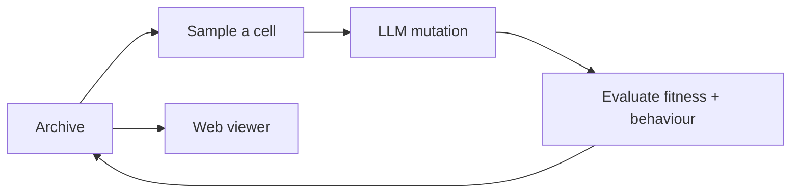

# CVT-MAP-Elites for LLM-driven evolution

> **Find better programs without losing the interesting ones.**
>
> `cvt-map-elites-llm` is a Python library for evolving code with large language models. It combines CVT-MAP-Elites, adaptive sampling, configurable LLM emitters, persistent run storage, and a web viewer.

[](https://www.python.org/) [](LICENSE)

## Why MAP-Elites?

A conventional optimizer returns one best answer. MAP-Elites maintains an **archive of strong, different answers**.

Each candidate has:

- **Fitness:** how well it solves the task.
- **Behaviour descriptors:** what kind of solution it is, such as size, speed, complexity, or style.

The descriptor space is divided into CVT cells. Each cell keeps its best candidate, allowing the search to improve quality while preserving diversity.



## Features

- **CVT-MAP-Elites archive** with adaptive normalisation and remapping
- **Adaptive cell sampling** with UCB and uniform baselines
- **Curiosity-driven emitters** for exploit/explore decisions
- **LLM mutations** using diffs or complete rewrites
- **Custom evaluators** for any language, simulator, or test suite
- **Staged secondary evaluation** for expensive measurements
- **Persistent, resumable runs** with prompts, responses, scores, events, and checkpoints
- **React/FastAPI web viewer** for archives, candidates, sampling, and fitness

## Installation

Requires Python 3.10+ and [`uv`](https://docs.astral.sh/uv/):

```bash
uv sync
```

Build the viewer frontend:

```bash
cd viewer/frontend
npm install
npm run build
```

Run tests:

```bash
uv run pytest
```

## Quick start

The engine owns the evolutionary search. You provide a fitness function and a behaviour descriptor.

```python
from evo_lib import EvolutionConfig, EvolutionEngine, LLMConfig
from evo_lib.config import SamplingConfig


def fitness(candidate):
    return run_tests(candidate.code)


def descriptors(candidate):
    return [len(candidate.code), cyclomatic_complexity(candidate.code)]


config = EvolutionConfig(
    run_name="my_search",
    user_prompt="""Improve this program.

Target:
{target_candidate}

Instructions:
{extra_instructions}
""",
    llm=LLMConfig(
        api_base_url="https://your-openai-compatible-endpoint/v1",
        api_key="your-key",
        model="your-model",
    ),
    sampling=SamplingConfig(
        cell_method="ucb",
        emitter_method="single_curiosity",
    ),
)

engine = EvolutionEngine(
    config=config,
    primary_fitness=fitness,
    descriptor_fn=descriptors,
)
engine.initialize([])
engine.run(steps=100)
```

The same engine can evolve Python, C++, SQL, shader code, prompts, or any other text-based artefact.

## Sampling and emitters

```python
from evo_lib.config import SamplingConfig

SamplingConfig(
    cell_method="ucb",                 # "ucb" | "uniform"
    cell_ucb_c=1.4,
    emitter_method="single_curiosity", # "single_curiosity" | "fixed" | "ucb" | "thompson"
)
```

The default emitters are:

| Emitter | Role |
| --- | --- |
| `exploit` | Refine strong candidates and repair edge cases |
| `explore` | Try new algorithms and behaviour regions |

You can define your own emitters with `EmitterConfig`, including custom instructions, temperature, and thinking mode.

## Fitness statistics

Return `(score, stats)` when you want diagnostic information saved and shown in later prompts:

```python
def fitness(candidate):
    score, passed, total = evaluate(candidate.code)
    return score, {
        "test_pass_rate": {
            "value": passed / total,
            "explanation": "Fraction of tests passed",
        },
        "source_bytes": {
            "value": len(candidate.code),
            "explanation": "Program size in bytes",
        },
    }
```

## Run storage

Runs are saved in timestamped directories:

```text
runs/my_search_.../
├── config.json
├── metadata.json
├── candidates.jsonl
├── events.jsonl
├── llm_calls.jsonl
├── stats.jsonl
├── archive_snapshots/
└── checkpoints/
```

Load a checkpoint to continue or fork an experiment:

```python
engine = EvolutionEngine.load_from_checkpoint(
    "runs/my_search_.../checkpoints/latest.pkl",
    primary_fitness=fitness,
    descriptor_fn=descriptors,
    llm_client=client,
    resume_mode="continue",  # or "fork"
)
engine.run(steps=200)
```

## Web viewer

```bash
./run_viewer.sh       # production
./run_viewer_dev.sh   # development with hot reload
```

Open `http://localhost:8000` in production or `http://localhost:5173` in development.

The viewer includes:

- Run discovery and comparison
- Fitness charts and event timelines
- CVT/Voronoi archive maps
- Per-cell sampling statistics
- Candidate code, ancestry, and LLM traces

For remote access:

```bash
HOST=0.0.0.0 PORT=8000 ./run_viewer.sh
```

## License

[MIT License](LICENSE)
